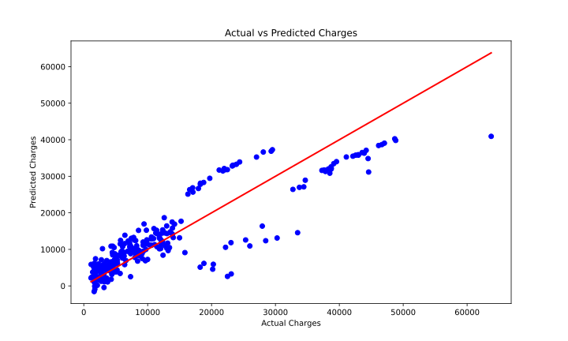

Objective: Estimate individual medical insurance expenses based on factors such as age,
BMI, smoking status, and other health-related variables

Output:

To insert an SVG (Scalable Vector Graphics) in your markdown, you can use the following syntax:

```markdown

```


   age     sex     bmi  children smoker     region      charges
0   19  female  27.900         0    yes  southwest  16884.92400
1   18    male  33.770         1     no  southeast   1725.55230
2   28    male  33.000         3     no  southeast   4449.46200
3   33    male  22.705         0     no  northwest  21984.47061
4   32    male  28.880         0     no  northwest   3866.85520
<class 'pandas.core.frame.DataFrame'>
RangeIndex: 1338 entries, 0 to 1337
Data columns (total 7 columns):
 #   Column    Non-Null Count  Dtype
---  ------    --------------  -----
 0   age       1338 non-null   int64
 1   sex       1338 non-null   object
 2   bmi       1338 non-null   float64
 3   children  1338 non-null   int64
 4   smoker    1338 non-null   object
 5   region    1338 non-null   object
 6   charges   1338 non-null   float64
dtypes: float64(2), int64(2), object(3)
memory usage: 73.3+ KB
None
               age          bmi     children       charges
count  1338.000000  1338.000000  1338.000000   1338.000000
mean     39.207025    30.663397     1.094918  13270.422265
std      14.049960     6.098187     1.205493  12110.011237
min      18.000000    15.960000     0.000000   1121.873900
25%      27.000000    26.296250     0.000000   4740.287150
50%      39.000000    30.400000     1.000000   9382.033000
75%      51.000000    34.693750     2.000000  16639.912515
max      64.000000    53.130000     5.000000  63770.428010
age         0
sex         0
bmi         0
children    0
smoker      0
region      0
charges     0
dtype: int64
Mean Squared Error (MSE): 33596915.85
R-squared (R²): 0.78
                   Coefficient
age                 256.975706
sex                  18.591692
bmi                 337.092552
children            425.278784
smoker            23651.128856
region_northwest   -370.677326
region_southeast   -657.864297
region_southwest   -809.799354
